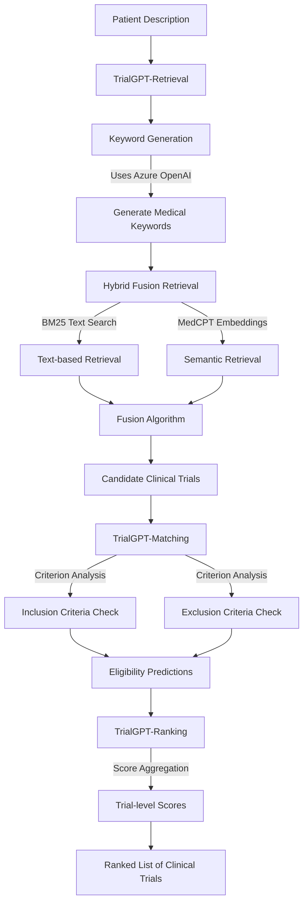

# TrialGPT System Explanation

## Overview

TrialGPT is an end-to-end framework that uses large language models (LLMs) for matching patients to appropriate clinical trials. The system consists of three key components that work together to provide accurate and efficient patient-trial matching:

1. **TrialGPT-Retrieval**: Filters irrelevant clinical trials at scale
2. **TrialGPT-Matching**: Analyzes patient eligibility on a criterion-by-criterion basis
3. **TrialGPT-Ranking**: Aggregates criterion-level predictions into trial-level scores

## System Architecture




## Detailed Component Explanation

### 1. TrialGPT-Retrieval

This component efficiently filters through thousands of clinical trials to identify relevant candidates for a given patient.

#### Keyword Generation
- Takes a patient description as input
- Utilizes Azure OpenAI API (GPT-4/GPT-3.5) to extract relevant medical conditions and terms
- Outputs a structured list of medical keywords ranked by priority

```python
def get_keyword_generation_messages(note):
    system = 'You are a helpful assistant and your task is to help search relevant clinical trials...'
    prompt = f"Here is the patient description: \n{note}\n\nJSON output:"
    messages = [
        {"role": "system", "content": system},
        {"role": "user", "content": prompt}
    ]
    return messages
```

#### Hybrid Fusion Retrieval
- Uses two complementary retrieval methods:
  1. **BM25 Text Search**: Traditional lexical matching for precise keyword matches
  2. **MedCPT Embeddings**: Neural semantic search using specialized medical embeddings

- The results are then combined using a reciprocal rank fusion algorithm to leverage strengths of both approaches

```python
def get_bm25_corpus_index(corpus):
    # Initialize or load BM25 search index
    # ...

def get_medcpt_corpus_index(corpus):
    # Initialize or load MedCPT embeddings
    # ...
```

### 2. TrialGPT-Matching

This component performs a detailed analysis of patient eligibility for each trial criterion.

- Takes candidate clinical trials from the retrieval stage
- Processes each trial's inclusion and exclusion criteria
- Analyzes the patient's eligibility for each criterion using LLMs
- Produces structured output with detailed reasoning:
  - Patient relevance
  - Evidence sentences from patient description
  - Final eligibility determination

```python
def parse_criteria(criteria):
    # Format trial criteria for analysis
    # ...

def trialgpt_matching(trial, patient, model):
    # Analyze patient eligibility for each criterion
    # Using Azure OpenAI to make predictions
    # ...
```

### 3. TrialGPT-Ranking

This component aggregates the criterion-level predictions into a final ranking of clinical trials.

- Takes criterion-level predictions from TrialGPT-Matching
- Uses LLMs to weigh the importance of different criteria
- Considers both inclusion and exclusion criteria in the final score
- Produces a ranked list of clinical trials with confidence scores

```python
def convert_criteria_pred_to_string(prediction, trial_info):
    # Format criterion predictions for ranking
    # ...

def trialgpt_aggregation(trial, criterion_preds, model):
    # Aggregate criterion-level predictions into a final score
    # ...
```

## Implementation Details

- **Language Models**: The system uses Azure OpenAI API (configurable to use different models like GPT-4-turbo)
- **Embedding Models**: Medical-specific embedding models (MedCPT) for semantic understanding of medical concepts
- **Text Processing**: Custom tokenization for processing medical texts
- **Architecture**: Modular design allowing for independent optimization of each component

## System Requirements

- Python 3.9+
- NLTK for text processing
- Azure OpenAI API access
- Clinical trials database (from ClinicalTrials.gov)
- CUDA-capable GPU for embedding generation (optional but recommended)

## Performance

When evaluated on publicly available cohorts:
- TrialGPT-Retrieval: >90% recall using only <6% of the initial clinical trial collection
- TrialGPT-Matching: 87.3% criterion-level accuracy (close to expert performance of 88.7%–90.0%)
- TrialGPT-Ranking: Outperforms competing models by 28.8% to 53.5% in ranking tasks
- Efficiency: Reduces screening time by 42.6% in real-life clinical trial matching

## Data Flow

1. **Input**: Patient description/summary
2. **Processing**:
   - Generate medical keywords from the patient description
   - Retrieve candidate trials using hybrid search
   - Analyze eligibility for each criterion of each trial
   - Aggregate scores and rank trials
3. **Output**: Ranked list of clinical trials with relevance scores

This system combines the strengths of traditional information retrieval and modern large language models to provide accurate, transparent, and efficient clinical trial matching. 